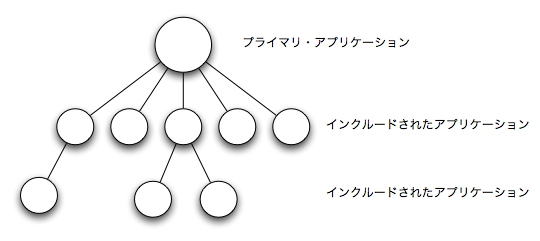

.. 8 Included Applications

.. _included_applications:

==============================
アプリケーションのインクルード
==============================

.. 8.1 Definition

定義
====

.. An application can include other applications. An included application 
   has its own application directory and .app file, but it is started as
   part of the supervisor tree of another application.

アプリケーションは、他のアプリケーションをインクルードすることができます。インクルードされるアプリケーションは、自分のアプリケーションのディレクトリと、 ``.app`` ファイルを持ちますが、他のアプリケーションの監視ツリーの一部として起動されます。

.. An application can only be included by one other application.

アプリケーションは、他の一つのアプリケーションからしかインクルードできません。

.. An included application can include other applications.

インクルードされたアプリケーションは、他のアプリケーションをインクルードすることができます。

.. An application which is not included by any other application is 
   called a primary application. 

他のアプリケーションからインクルードされていないアプリケーションを、プライマリ・アプリケーションと呼びます。

.. The application controller will automatically load any included applications when 
   loading a primary application, but not start them. Instead, the top supervisor of 
   the included application must be started by a supervisor in the including application.

アプリケーション・コントローラは、プライマリ・アプリケーションをロードする時は、自動的にインクルードされたアプリケーションをロードしますが、起動はしません。インクルードされたアプリケーションのトップのスーパバイザは、インクルードしたアプリケーションのスーパバイザから起動されなければなりません。

.. This means that when running, an included application is in fact part of the 
   primary application and a process in an included application will consider 
   itself belonging to the primary application.

これは、起動されるときは、インクルードされたアプリケーションは、プライマリ・アプリケーションの一部となり、インクルードされたアプリケーションのプロセスは、プライマリ・アプリケーションに属しているとみなされます。

.. 8.2 Specifying Included Applications

インクルードされるアプリケーションの指定
========================================

.. Which applications to include is defined by the included_applications key in the .app file.

どのアプリケーションがインクルードされるかは、 ``.app`` ファイルの ``included_applications`` キーで指定します。

.. code-block:: erlang

   {application, prim_app,
    [{description, "Tree application"},
     {vsn, "1"},
     {modules, [prim_app_cb, prim_app_sup, prim_app_server]},
     {registered, [prim_app_server]},
     {included_applications, [incl_app]},
     {applications, [kernel, stdlib, sasl]},
     {mod, {prim_app_cb,[]}},
     {env, [{file, "/usr/local/log"}]}
    ]}.

.. 8.3 Synchronizing Processes During Startup

スタートアップ時のプロセスの同期
================================

.. The supervisor tree of an included application is started as part of the
   supervisor tree of the including application. If there is a need for
   synchronization between processes in the including and included applications,
   this can be achieved by using start phases.

インクルードされたアプリケーションの監視ツリーは、インクルードをしたアプリケーショの監視ツリーの一部として起動します。もし、インクルードするアプリケーションと、インクルードされるアプリケーションの間で同期を取る必要があれば、「起動フェイズ」を利用して実現することができます。

.. Start phases are defined by the start_phases key in the .app file as a list 
   of tuples {Phase,PhaseArgs}, where Phase is an atom and PhaseArgs is a term. 
   Also, the value of the mod key of the including application must be set to 
   {application_starter,[Module,StartArgs]}, where Module as usual is the 
   application callback module and StartArgs a term provided as argument to 
   the callback function Module:start/2.

起動フェイズは、 ``.app`` ファイルの ``start_phases`` キーによって定義された、 ``{Phase, PhaseArgs}`` というタプルのリストを使って定義します。 ``Phase`` にはアトムを、 ``PhaseArgs`` には項を指定します。インクルードするアプリケーションの ``mod`` キーの、 ``{application_starter,[Module,StartArgs]}`` を設定する必要があります。この ``Module`` には、通常はアプリケーション・コールバック・モジュールを、 ``StartArgs`` にはコールバック関数の ``Module:start/2`` に渡す引数の項を設定します。

.. code-block:: erlang

   {application, prim_app,
    [{description, "Tree application"},
     {vsn, "1"},
     {modules, [prim_app_cb, prim_app_sup, prim_app_server]},
     {registered, [prim_app_server]},
     {included_applications, [incl_app]},
     {start_phases, [{init,[]}, {go,[]}]},
     {applications, [kernel, stdlib, sasl]},
     {mod, {application_starter,[prim_app_cb,[]]}},
     {env, [{file, "/usr/local/log"}]}
    ]}.

   {application, incl_app,
    [{description, "Included application"},
     {vsn, "1"},
     {modules, [incl_app_cb, incl_app_sup, incl_app_server]},
     {registered, []},
     {start_phases, [{go,[]}]},
     {applications, [kernel, stdlib, sasl]},
     {mod, {incl_app_cb,[]}}
    ]}.

.. When starting a primary application with included applications, the primary 
   application is started the normal way: The application controller creates an 
   application master for the application, and the application master calls 
   Module:start(normal, StartArgs) to start the top supervisor.

インクルードされたアプリケーションを含む、プライマリ・アプリケーションが起動されると、プライマリ・アプリケーションは通常通り起動されます。アプリケーション・コントローラがアプリケーションマスターを作り、アプリケーションマスターが、トップのスーパバイザを起動するために、 ``Module:start(normal, StartArgs)`` を呼び出します。

.. Then, for the primary application and each included application in top-down, 
   left-to-right order, the application master calls Module:start_phase(Phase, 
   Type, PhaseArgs) for each phase defined for for the primary application, in that 
   order. Note that if a phase is not defined for an included application, the 
   function is not called for this phase and application.

アプリケーションマスターは、プライマリ・アプリケーションで定義されたフェイズごとに、深さ優先探索で、 ``Module:start_phase(Phase, Type, PhaseArgs)`` を呼び出します。もし、インクルードされたアプリケーションにフェイズが定義されていない場合には、そのアプリケーションのそのフェイズの関数呼び出しはスキップされます。

.. The following requirements apply to the .app file for an included application:

インクルードされたアプリケーション向けの ``.app`` には次のような設定を行います。

.. * The {mod, {Module,StartArgs}} option must be included. This option is used to 
     find the callback module Module of the application. StartArgs is ignored, as 
     Module:start/2 is called only for the primary application.

* ``{mod, {Module, StartArgs}}`` オプションは指定しなければなりません。このオプションはアプリケーションのコールバックモジュールの ``Module`` を発見するのに使用されます。 ``StartArgs`` は無視され、プライマリ・アプリケーションの ``Module:start/2`` だけが呼ばれます。

.. * If the included application itself contains included applications, instead the 
     option {mod, {application_starter, [Module,StartArgs]}} must be included.

* もし、インクルードされたアプリケーション自身が、他のアプリケーションをインクルードしていた場合には、代わりに ``{mod, {application_starter, [Module,StartArgs]}}`` オプションを含めなければなりません。

.. * The {start_phases, [{Phase,PhaseArgs}]} option must be included, and the set 
     of specified phases must be a subset of the set of phases specified for the 
     primary application.

* ``{start_phases, [{Phase,PhaseArgs}]}`` オプションは設定しなければなりません。また、設定されるフェーズは、プライマリ・アプリケーションで指定したフェーズのサブセットでなければなりません。

.. When starting prim_app as defined above, the application controller will call 
   the following callback functions, before application:start(prim_app) returns a value:

もし上記のように ``prim_app`` の起動方法が定義されているのであれば、 ``application:start(prim_app)`` が値を返すまでの間に、アプリケーション・コントローラは次のような順番でコールバックを呼び出します。

.. code-block:: none

   application:start(prim_app)
    => prim_app_cb:start(normal, [])
    => prim_app_cb:start_phase(init, normal, [])
    => prim_app_cb:start_phase(go, normal, [])
    => incl_app_cb:start_phase(go, normal, [])
   ok

Copyright (c) 1991-2009 Ericsson AB
