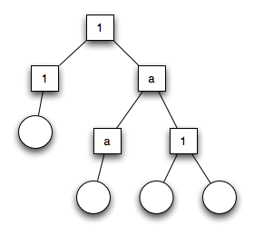

.. 1 Overview

.. _overview:

====
概要
====

.. The OTP Design Principles is a set of principles for how to structure Erlang 
   code in terms of processes, modules and directories.

OTPデザイン原則集は、プロセス、モジュール、ディレクトリといった用語セットを使って、実用的なErlangコードを組み立てるための原則集です。

.. 1.1 Supervision Trees

監視ツリー
==========

.. A basic concept in Erlang/OTP is the supervision tree. This is a process 
   structuring model based on the idea of workers and supervisors.

Erlang/OTPの基本的なコンセプトが、 **監視ツリー** (supervision tree)です。これは、 **ワーカー** 、 **スーパバイザ** といったアイディアを元にした、プロセスの構造化モデルです。

.. * Workers are processes which perform computations, that is, they do the actual 
     work.

* ワーカーは、計算を行うプロセスです。これは、その名のとおり実際に働きます。

.. * Supervisors are processes which monitor the behaviour of workers. A supervisor 
     can restart a worker if something goes wrong.

* スーパバイザはワーカーの振る舞いをモニターするプロセスです。スーパバイザは何か問題があった場合に、ワーカーを再起動することがあります。

.. * The supervision tree is a hierarchical arrangement of code into supervisors 
     and workers, making it possible to design and program fault-tolerant software.

* は、スーパバイザとワーカーが階層状に配置されたコードで、フォールトトレラントなソフトウェアの設計とプログラム開発を行えるようにします。

監視ツリー

.. In the figure above, square boxes represents supervisors and circles represent workers.

上記の図は、四角い箱がスーパーバイザーを、円がワーカーを示しています。

.. 1.2 Behaviours

ビヘイビア
==========

.. In a supervision tree, many of the processes have similar structures, they 
   follow similar patterns. For example, the supervisors are very similar in 
   structure. The only difference between them is which child processes they 
   supervise. Also, many of the workers are servers in a server-client relation, 
   finite state machines, or event handlers such as error loggers.

監視ツリーでは、多くのプロセスが同じようなパターンに従った、似た構造をしています。例えば、スーパバイザははどれも似たような構造をしています。それらの違いはスーパバイザが監視する子供のプロセスだけです。そのため、多くのワーカーがサーバ＝クライアントの関係におけるサーバであって、有限状態機械(FSM)を構成していて、エラーロガーのイベントハンドラをしています。

.. Behaviours are formalizations of these common patterns. The idea is to divide 
   the code for a process in a generic part (a behaviour module) and a specific 
   part (a callback module).

**ビヘイビア** というのは、これらの共通のパターンを形式化したものです。ビヘイビアの考え方は、プロセスに関する汎用的なコード(ビヘイビアモジュール)と、特定の部分(**コールバックモジュール**)に分割するというものです。

.. The behaviour module is part of Erlang/OTP. To implement a process such as a 
   supervisor, the user only has to implement the callback module which should 
   export a pre-defined set of functions, the callback functions.

ビヘイビアモジュールはErlang/OTPの一部です。スーパバイザのようなプロセスを実装するためには、ユーザは事前定義の関数と **コールバック関数** をエクスポートしている、コールバックのモジュールだけを定義すればよくなります。

.. An example to illustrate how code can be divided into a generic and a specific 
   part: Consider the following code (written in plain Erlang) for a simple server, 
   which keeps track of a number of "channels". Other processes can allocate and 
   free the channels by calling the functions alloc/0 and free/1, respectively.

どのようにして、汎用的なコードと特化したコードに分割されるのか、というサンプルを紹介します。プレーンなErlangで記述された、シンプルなサーバを実装した以下のコードについて見てみます。このサーバーは"channels"という数値を監視し続けます。他のプロセスはalloc/0, free/1をそれぞれ呼ぶことにより、チャンネルを割り当てたり、開放したりすることができます。

.. code-block:: erlang

   -module(ch1).
   -export([start/0]).
   -export([alloc/0, free/1]).
   -export([init/0]).

   start() ->
       spawn(ch1, init, []).

   alloc() ->
       ch1 ! {self(), alloc},
       receive
           {ch1, Res} ->
               Res
       end.

   free(Ch) ->
       ch1 ! {free, Ch},
       ok.

   init() ->
       register(ch1, self()),
       Chs = channels(),
       loop(Chs).

   loop(Chs) ->
       receive
           {From, alloc} ->
               {Ch, Chs2} = alloc(Chs),
               From ! {ch1, Ch},
               loop(Chs2);
           {free, Ch} ->
               Chs2 = free(Ch, Chs),
               loop(Chs2)
       end.

.. The code for the server can be rewritten into a generic part server.erl:

以下のサーバのコードは、汎用部分だけに書き直した server.erl になります:

.. code-block:: erlang

   -module(server).
   -export([start/1]).
   -export([call/2, cast/2]).
   -export([init/1]).

   start(Mod) ->
       spawn(server, init, [Mod]).

   call(Name, Req) ->
       Name ! {call, self(), Req},
       receive
           {Name, Res} ->
               Res
       end.

   cast(Name, Req) ->
       Name ! {cast, Req},
       ok.

   init(Mod) ->
       register(Mod, self()),
       State = Mod:init(),
       loop(Mod, State).

   loop(Mod, State) ->
       receive
           {call, From, Req} ->
               {Res, State2} = Mod:handle_call(Req, State),
               From ! {Mod, Res},
               loop(Mod, State2);
           {cast, Req} ->
               State2 = Mod:handle_cast(Req, State),
               loop(Mod, State2)
       end.

.. and a callback module ch2.erl:

以下のコードはコールバックモジュールの :file:`ch2.erl` になります:

.. code-block:: erlang

  -module(ch2).
  -export([start/0]).
  -export([alloc/0, free/1]).
  -export([init/0, handle_call/2, handle_cast/2]).

  start() ->
      server:start(ch2).

  alloc() ->
      server:call(ch2, alloc).

  free(Ch) ->
      server:cast(ch2, {free, Ch}).

  init() ->
      channels().

  handle_call(alloc, Chs) ->
      alloc(Chs). % => {Ch,Chs2}

  handle_cast({free, Ch}, Chs) ->
      free(Ch, Chs). % => Chs2

.. Note the following:

以上から、以下のような気づきが得られます:

.. * The code in server can be re-used to build many different servers.

* サーバコードは多くの異なるサーバの構築の際に再利用することができます

.. * The name of the server, in this example the atom ch2, is hidden from 
     the users of the client functions. This means the name can be changed 
     without affecting them.

* サーバ名は、このサンプルではアトムのch2になります。これはクライアント関数のユーザから隠されます。これは、ユーザに影響を与えずに名前を変更することができるということをあらわしています。

.. * The protcol (messages sent to and received from the server) is hidden 
     as well. This is good programming practice and allows us to change the 
     protocol without making changes to code using the interface functions.

* サーバへのメッセージ送信と、サーバからの受信のプロトコルをうまく隠蔽されます。これは、インタフェース関数を利用しているコードを変更することなく、プロトコルの変更が可能になるため、よいプログラミングのプラクティスといえます。

.. * We can extend the functionality of server, without having to change ch2 
     or any other callback module.

* ch2や他のコールバックモジュールを変更しないで、サーバの機能を拡張することができます。

.. (In ch1.erl and ch2.erl above, the implementation of channels/0, alloc/1 and 
   free/2 has been intentionally left out, as it is not relevant to the example. 
   For completeness, one way to write these functions are given below. Note that 
   this is an example only, a realistic implementation must be able to handle 
   situations like running out of channels to allocate etc.)

上記の :file:`ch1.erl` と :file:`ch2.erl` では、 ``channels/0``, ``alloc/1``, ``free/2`` の実装はサンプルに関連していないため、意図的に省略しています。完全を期すために必要な、これらの関数の実装方法の一つは下記のようになります。これはサンプル専用の実装で、現実のアプリケーションを実装するためには、チャンネルの割り当てを使い切ってしまうという状況など、さまざまな例外状況に対処する必要があります。

.. code-block:: erlang

  channels() ->
     {_Allocated = [], _Free = lists:seq(1,100)}.

  alloc({Allocated, [H|T] = _Free}) ->
     {H, {[H|Allocated], T}}.
  
  free(Ch, {Alloc, Free} = Channels) ->
     case lists:member(Ch, Alloc) of
        true ->
           {lists:delete(Ch, Alloc), [Ch|Free]};
        false ->
           Channels
     end.        

.. Code written without making use of behaviours may be more efficient, but the 
   increased efficiency will be at the expense of generality. The ability to 
   manage all applications in the system in a consistent manner is very important.

ビヘイビアを利用せずに書かれたコードは、処理速度の面では効率的かもしれませんが、効率を改善するために一般性を犠牲にすることになります。一貫した方法で、システム内のすべてのアプリケーションを管理できるようにすることは非常に大切です。

.. Using behaviours also makes it easier to read and understand code written by 
   other programmers. Ad hoc programming structures, while possibly more efficient, 
   are always more difficult to understand.

ビヘイビアを利用すると、他のプログラマが書いたコードを読んで理解するのが容易になります。その場限りのアドホックなプログラム構造では、効率が良い場合もあるかもしれませんが、たいていの場合は理解が難しくなります。

.. The module server corresponds, greatly simplified, to the Erlang/OTP behaviour gen_server.

サーバのモジュールは、Erlang/OTPのビヘイビアのgen_serverに対応します。gen_serverを使うことで大幅に簡略化されます。

.. The standard Erlang/OTP behaviours are:

標準的なErlang/OTPのビヘイビアには以下のものがあります:

:ref:`gen_server`

   .. For implementing the server of a client-server relation. 

   クライアント＝サーバの関係における、サーバを実装しています

:ref:`gen_fsm`

   .. For implementing finite state machines. 

   有限状態機械を実装しています

:ref:`gen_event`

   .. For implementing event handling functionality. 

   イベントハンドリングの機能を実装しています

:ref:`supervisor`

   .. For implementing a supervisor in a supervision tree. 

   監視ツリーのスーパバイザを実装しています

.. The compiler understands the module attribute -behaviour(Behaviour) and issues 
   warnings about missing callback functions. Example:

コンパイラはモジュール属性の ``-behaviour(Behaviour)`` という行を理解します。もしもコールバック関数が足りない場合には、以下のように警告を出します:

.. code-block:: erlang

  -module(chs3).
  -behaviour(gen_server).
  ...

  3> c(chs3).
  ./chs3.erl:10: Warning: undefined call-back function handle_call/3
  {ok,chs3}

.. 1.3 Applications

アプリケーション
================

.. Erlang/OTP comes with a number of components, each implementing some specific 
   functionality. Components are with Erlang/OTP terminology called applications. 
   Examples of Erlang/OTP applications are Mnesia, which has everything needed for 
   programming database services, and Debugger which is used to debug Erlang 
   programs. The minimal system based on Erlang/OTP consists of the applications 
   Kernel and STDLIB.

Erlang/OTPはいくつものコンポーネントを伴います。それぞれのコンポーネントは、特定の機能を実装しています。Erlang/OTPの用語では、コンポーネントを **アプリケーション** と呼びます。Erlang/OTPアプリケーションのサンプルはMnesiaです。これはデータベースサービスをプログラムするのに必要なすべての機能を持っています。また、Debuggerもアプリケーションです。これはErlangのプログラムのデバッグに使用されます。最小のErlang/OTPベースのシステムは、KernelアプリケーションとSTDLIBアプリケーションを含みます。

.. The application concept applies both to program structure (processes) and 
   directory structure (modules).

アプリケーションの考え方は、プログラムの構造(プロセス)と、ディレクトリ構造(モジュール)の両方に適用されます。

.. The simplest kind of application does not have any processes, but consists of 
   a collection of functional modules. Such an application is called a library 
   application. An example of a library application is STDLIB.

もっともシンプルな種類のアプリケーションはプロセスを一つも含みませんが、いくつかの機能を実装したモジュールで構成されます。このようなアプリケーションは、 **ライブラリアプリケーション** と呼ばれます。ライブラリアプリケーションのサンプルとしてはSTDLIBがあります。

.. An application with processes is easiest implemented as a supervision tree using 
   the standard behaviours.

プロセスを含むアプリケーションは、標準的なビヘイビアを使用して、監視ツリーとして実装するのが最も簡単です。

.. How to program applications is described in Applications.

どのようにアプリケーションをプログラムしていくのか、ということについては、 :ref:`applications` の章で説明していきます。

.. 1.4 Releases

リリース
========

.. A release is a complete system made out from a subset of the Erlang/OTP 
   applications and a set of user-specific applications.

**リリース** はErlang/OTPアプリケーションのサブセットと、ユーザ定義のアプリケーションから作成されます。

.. How to program releases is described in Releases.

どのようにリリースをプログラムするのか、ということについては :ref:`releases` の章で説明していきます。

.. How to install a release in a target environment is described in the chapter 
   about Target Systems in System Principles.

対象となる環境にどのようにリリースをインストールするのか、ということについては、システム原則の中のターゲットシステムの章で説明していきます。

.. 1.5 Release Handling

リリースのハンドリング
======================

.. Release handling is upgrading and downgrading between different versions of a 
   release, in a (possibly) running system. How to do this is described in Release Handling.

**リリースのハンドリング** というのは、実行中のシステムにおいて、異なるバージョンのリリースの間で、アップグレードしたり、ダウングレードしたりすることです。どのようにこれを行うのか、ということに関しては、 :ref:`release handling` の章で説明していきます。

Copyright (c) 1991-2009 Ericsson AB
