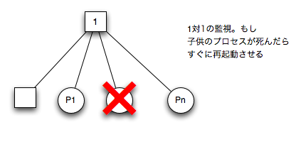
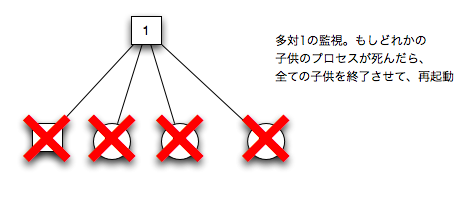

.. 5 Supervisor Behaviour

.. _supervisor:

========================
スーパバイザ・ビヘイビア
========================

.. This section should be read in conjunction with supervisor(3), where all details 
   about the supervisor behaviour is given.

このセクションは、 supervisor(3) と密接に関連しています。この関数がスーパバイザの振る舞いの詳細はすべて、この関数で提供されます。

.. 5.1 Supervision Principles

スーパバイザの原則
==================

.. A supervisor is responsible for starting, stopping and monitoring its child 
   processes. The basic idea of a supervisor is that it should keep its child 
   processes alive by restarting them when necessary.

スーパバイザは、子プロセスの起動、停止、モニタリングの責任を持っています。スーパバイザの基本的な考え方は、必要に応じて再起動することで、子プロセスをずっと生きた状態にしておく、というものです。

.. Which child processes to start and monitor is specified by a list of child 
   specifications. The child processes are started in the order specified by 
   this list, and terminated in the reversed order.

子プロセスの起動とモニタリングは、 :ref:`child_spec` のリストを渡すことによって設定されます。子プロセスの起動はこのリストで定義された順番で行われ、終了時はこれとは逆の順序で行われます。

.. 5.2 Example

サンプル
========

.. The callback module for a supervisor starting the server from the gen_server 
   chapter could look like this:

:ref:`gen_server` の章にあった、サーバを起動するスーパバイザのためのコールバックモジュールのコードは以下のようなコードでした:

.. code-block:: erlang

  -module(ch_sup).
  -behaviour(supervisor).

  -export([start_link/0]).
  -export([init/1]).

  start_link() ->
      supervisor:start_link(ch_sup, []).

  init(_Args) ->
      {ok, {{one_for_one, 1, 60},
            [{ch3, {ch3, start_link, []},
              permanent, brutal_kill, worker, [ch3]}]}}.

.. one_for_one is the restart strategy.

``one_for_one`` は :ref:`restart` です。

.. 1 and 60 defines the maximum restart frequency.

1と60の数値は、 :ref:`restart_requency` を定義します。

.. The tuple {ch3, ...} is a child specification.

タプルの ``{ch3, ...}`` は :ref:`child_spec` です。

.. 5.3 Restart Strategy

.. _restart:

再起動戦略
==========

one_for_one
-----------

.. If a child process terminates, only that process is restarted.

もし一つの子プロセスが終了したら、そのプロセスだけを再起動します。

.. One_For_One Supervision

one_for_one監視

one_for_all
-----------

.. If a child process terminates, all other child processes are 
   terminated and then all child processes, including the terminated one, are restarted.

もし一つ子プロセスが終了したら、他のすべてのこプロセスも終了させられ、最初に終了したものも含めて、すべての子プロセスが再起動します。

.. One_For_All Supervision

one_for_all 監視

rest_for_one
------------

.. If a child process terminates, the 'rest' of the child processes -- 
   i.e. the child processes after the terminated process in start order 
   -- are terminated. Then the terminated child process and the rest of 
   the child processes are restarted.

子プロセスの一つが終了したら、子プロセスの残り、例えば、起動順序が終了したプロセスの次だった子プロセスなどが終了させられます。その後、子プロセスと、残りの子プロセスが再起動します。

.. Maximum Restart Frequency

.. _restart_requency:

再起動頻度の最大値
==================

.. The supervisors have a built-in mechanism to limit the number of restarts 
   which can occur in a given time interval. This is determined by the values 
   of the two parameters MaxR and MaxT in the start specification returned by 
   the callback function init:

スーパバイザは、指定された時間間隔内で再起動するプロセス数を制限する機能を持っています。これは、スタート時に呼ばれる、 ``init`` コールバック関数の返り値に含まれる、MaxRとMaxTという２つのパラメータ値によって決定されます:

.. code-block:: erlang

   init(...) ->
       {ok, {{RestartStrategy, MaxR, MaxT},
             [ChildSpec, ...]}}.

.. If more than MaxR number of restarts occur in the last MaxT seconds, then 
   the supervisor terminates all the child processes and then itself.

MaxT秒の間に、MaxRの数値以上に再起動が発生した場合に、スーパバイザはすべての子プロセスを終了させた後に、自分自身を終了させます。

.. When the supervisor terminates, then the next higher level supervisor takes 
   some action. It either restarts the terminated supervisor, or terminates itself.

スーパバイザが終了すると、次の上位のスーパーバイザーも同じ行動を起こします。つまり、終了したスーパバイザを再起動するか、自分自身を終了させます。

.. The intention of the restart mechanism is to prevent a situation where a 
   process repeatedly dies for the same reason, only to be restarted again.

この再起動メカニズムが提供されている意図は、同じ理由でプロセスが異常終了しているという状況で、全体をもう一度再起動する、という用途で使われることを想定しています。

.. 5.5 Child Specification

.. _child_spec:

子プロセスの仕様の設定
======================

This is the type definition for a child specification:

次のコードは子供の仕様に対するtype定義です:

.. code-block:: erlang

   {Id, StartFunc, Restart, Shutdown, Type, Modules}
       Id = term()
       StartFunc = {M, F, A}
           M = F = atom()
           A = [term()]
       Restart = permanent | transient | temporary
       Shutdown = brutal_kill | integer() &gt;=0 | infinity
       Type = worker | supervisor
       Modules = [Module] | dynamic
           Module = atom()

.. * Id is a name that is used to identify the child specification internally 
     by the supervisor.

* ``Id`` は子供の仕様を、内部的にスーパバイザが見分けを付けるために必要な名前です。

.. * StartFunc defines the function call used to start the child process. 
     It is a module-function-arguments tuple used as apply(M, F, A).

     It should be (or result in) a call to supervisor:start_link, gen_server:start_link,
     gen_fsm:start_link or gen_event:start_link. (Or a function compliant with these 
     functions, see supervisor(3) for details.

* ``StartFunc`` は子プロセスを起動するのに仕様される関数を定義します。これは「モジュール、関数、引数」のタプルで定義され、 ``apply(M, F, A)`` のように使用されます。

  ここで設定する関数は、 ``supervisor:start_link``, ``gen_server:start_link``, ``gen_fsm:start_link``, ``gen_event:start_link`` 、あるいはこれらを呼び出す関数を設定スべきです。

      
.. * Restart defines when a terminated child process should be restarted.

* ``Restart`` では、子プロセスが異常終了したときに、再起動すべきかどうかを設定します。

   .. * A permanent child process is always restarted.

   * ``permanent`` が設定されると、子プロセスは常に再起動させられます。

   .. * A temporary child process is never restarted.

   * ``temporary`` が設定されると、子プロさせうは再起動させられません。

   .. * A transient child process is restarted only if it terminates abnormally, 
        i.e. with another exit reason than normal.

   * ``transient`` が設定されると、通常とは違う理由で終了したなど、異常終了時にのみ再起動させられます。

.. * Shutdown defines how a child process should be terminated.

.. _shutdown_strategy:

* ``Shutdown`` では、子プロセスを終了すべきときに、どのように行うかを設定します。

   .. * brutal_kill means the child process is unconditionally terminated using 
        exit(Child, kill).

   * ``brutal_kill`` が設定されると、 ``exit(Child, kill)`` を使って無条件に終了させられます。

   .. * An integer timeout value means that the supervisor tells the child process 
        to terminate by calling exit(Child, shutdown) and then waits for an exit 
        signal back. If no exit signal is received within the specified time, 
        the child process is unconditionally terminated using exit(Child, kill).

   * 整数が与えられると、スーパバイザが ``exit(Child, kill)`` を呼び出して強制終了するまでのタイムアウト時間の意味になります。ここで設定された時間だけ、終了シグナルが返ってくるのを待ちます。ここで設定された時間内に終了シグナルが受け取れなかった場合には、 ``exit(Child, kill)`` を呼び出して無条件で子プロセスを終了します。

   .. * If the child process is another supervisor, it should be set to infinity 
        to give the subtree enough time to shutdown.

   もし、子プロセスが、他のプロセスのスーパバイザである場合には、 ``infinity`` を設定して、サブツリーの終了に十分な時間を与えましょう。

.. * Type specifies if the child process is a supervisor or a worker.

* ``Type`` は子プロセスがスーパバイザか、ワーカーかを設定します。

.. * Modules should be a list with one element [Module], where Module is the 
     name of the callback module, if the child process is a supervisor, 
     gen_server or gen_fsm. If the child process is a gen_event, Modules should be dynamic.

     This information is used by the release handler during upgrades and downgrades, 
     see Release Handling.

* ``Module`` には、要素が一つのリストを設定します。この要素には、コールバックモジュールの名前を設定します。もし、子プロセスがスーパバイザであれば、 ``gen_server`` か、 ``gen_fsm`` になります。もし、子プロセスが ``gen_event`` であれば、 ``dynamic`` を設定します。

  この情報は :ref:`release` で説明している、アップグレード、ダウングレードを行うリリースハンドラで使用される情報となります。

.. Example: The child specification to start the server ch3 in the example above 
   looks like:

サンプル: ``ch3`` サーバ起動する子プロセスの設定は次のようになります。

.. code-block:: erlang

   {ch3,
    {ch3, start_link, []},
    permanent, brutal_kill, worker, [ch3]}

.. Example: A child specification to start the event manager from the chapter about gen_event:

サンプル: :ref:`gen_event` の章のイベントマネージャを起動する子プロセスの設定は次のようになります。

.. code-block:: erlang

   {error_man,
    {gen_event, start_link, [{local, error_man}]},
    permanent, 5000, worker, dynamic}

.. Both the server and event manager are registered processes which can be expected 
   to be accessible at all times, thus they are specified to be permanent.

どちらのサーバも、常にアクセスできる状態であることが期待されているため、 ``permanent`` が設定さています。

.. ch3 does not need to do any cleaning up before termination, thus no shutdown 
   time is needed but brutal_kill should be sufficient. error_man may need some 
   time for the event handlers to clean up, thus Shutdown is set to 5000 ms.

``ch3`` は終了時に後処理を行う必要はないため、シャットダウンで何かを行うことはありません。そのため、 ``brutal_kill`` で十分です。 ``error_man`` はイベントハンドラの片付けにいくらか時間を必要とするため、 ``Shutdown`` には500ミリ秒を設定しています。

.. Example: A child specification to start another supervisor:

サンプル: 他のスーパバイザを起動する、子プロセスの定義です。

.. code-block:: erlang

   {sup,
    {sup, start_link, []},
    transient, infinity, supervisor, [sup]}

.. 5.6 Starting a Supervisor

スーパバイザの起動
==================

.. In the example above, the supervisor is started by calling ch_sup:start_link():

上記の例の場合、 ``ch_sup:start_link()`` を呼び出すことで、スーパバイザを起動することができます。

.. code-block:: erlang

   start_link() ->
       supervisor:start_link(ch_sup, []).

.. ch_sup:start_link calls the function supervisor:start_link/2. This function 
   spawns and links to a new process, a supervisor.

``ch_sup:start_link`` 関数は、 ``supervisor:start_link/2`` 関数を内部で呼んでいます。この関数は新しいプロセスをspawnして、スーパバイザとリンクさせます。

.. * The first argument, ch_sup, is the name of the callback module, that is 
     the module where the init callback function is located.

* 最初の引数の ``ch_sup`` はコールバックモジュールの名前です。 ``init`` コールバック関数が置かれているモジュールを指定します。

.. * The second argument, [], is a term which is passed as-is to the callback 
     function init. Here, init does not need any indata and ignores the argument.

* 2つ目の引数の ``[]`` は、コールバック関数 ``init`` にそのまま引渡されます。ここでは ``init`` は引数を必要としていないため、渡された引数は無視してます

.. In this case, the supervisor is not registered. Instead its pid must be used. 
   A name can be specified by calling supervisor:start_link({local, Name}, Module, 
   Args) or supervisor:start_link({global, Name}, Module, Args).

このケースでは、スーパバイザは登録されません。その代わり、Pidが直接使われます。名前を指定したい場合には、 ``supervisor:start_link({local, Name}, Module, Args)`` もしくは、 ``supervisor:start_link({global, Name}, Module, Args)`` を利用します。

.. The new supervisor process calls the callback function ch_sup:init([]). init is expected to 
   return {ok, StartSpec}:

新しいスーパバイザプロセスは、コールバック関数の ``ch_sup:init([])`` を呼び出します。返り値としては、 ``{ok, StartSpec}`` が期待されます。

.. code-block:: erlang

   init(_Args) ->
       {ok, {{one_for_one, 1, 60},
             [{ch3, {ch3, start_link, []},
               permanent, brutal_kill, worker, [ch3]}]}}.

.. The supervisor then starts all its child processes according to the child 
   specifications in the start specification. In this case there is one child process, ch3.

スーパバイザは、起動仕様にしたがって、指定されたすべての子プロセスを起動します。この場合、一つの子プロセスの ``ch3`` が起動します。

.. Note that supervisor:start_link is synchronous. It does not return until all 
   child processes have been started.

``supervisor:start_link`` は同期実行されます。この関数は、すべての子プロセスが起動し終わるまでは処理は帰ってきません。

.. 5.7 Adding a Child Process

子プロセスの追加
================

.. In addition to the static supervision tree, we can also add dynamic child 
   processes to an existing supervisor with the following call:

静的な監視ツリーに加えて、次のようなコードを使って、既存のスーパバイザに子プロセスを動的に追加することもできます。

.. code-block:: erlang

   supervisor:start_child(Sup, ChildSpec)

.. Sup is the pid, or name, of the supervisor. ChildSpec is a child specification.

``Sup`` には、スーパバイザのpidもしくは名前を設定します。 ``ChildSpec`` には :ref:child_spec` を渡します。

.. Child processes added using start_child/2 behave in the same manner as the other 
   child processes, with the following important exception: If a supervisor dies and 
   is re-created, then all child processes which were dynamically added to the 
   supervisor will be lost.

子プロセスは 、他の子プロセスと同じく、``start_child/2`` を使って追加されます。ただし、次のような例外があります。スーパバイザが死んで、再作成される場合、動的に追加されたすべての子プロセスは失われます。

.. 5.8 Stopping a Child Process

子プロセスの停止
================

Any child process, static or dynamic, can be stopped in accordance with the shutdown specification:

静的、動的に関わらず、すべての子プロセスは次のようなシャットダウン仕様に従って止めることができます。

.. code-block:: erlang

   supervisor:terminate_child(Sup, Id)

.. The child specification for a stopped child process is deleted with the following call:

停止した子プロセスの仕様は、次のように呼び出すと削除することができます。

.. code-block:: erlang

   supervisor:delete_child(Sup, Id)

.. Sup is the pid, or name, of the supervisor. Id is the id specified in 
   the child specification.

Supは、スーパバイザのpidか名前です。Idは :ref:`child_spec` の中で指定されているidです。

.. As with dynamically added child processes, the effects of deleting a 
   static child process is lost if the supervisor itself restarts.

動的に追加された子プロセスを持つ場合、スーパバイザ自身が再起動すると、静的な子プロセスの削除結果は失われます。

.. 5.9 Simple-One-For-One Supervisors

simple_one_for_oneスーパバイザ
==============================

.. A supervisor with restart strategy simple_one_for_one is a simplified 
   one_for_one supervisor, where all child processes are dynamically 
   added instances of the same process.

``simple_one_for_one`` というリスタート戦略を持っているスーパバイザは、単純化されて ``one_for_one`` スーパバイザとなります。これのすべての子プロセスは、同じプロセスのインスタンスに動的に追加されます。

.. Example of a callback module for a simple_one_for_one supervisor:

次のサンプルは、 ``simple_one_for_one`` スーパバイザのサンプルのコードです。

.. code-block:: erlang

   -module(simple_sup).
   -behaviour(supervisor).

   -export([start_link/0]).
   -export([init/1]).

   start_link() ->
       supervisor:start_link(simple_sup, []).

   init(_Args) ->
       {ok, {{simple_one_for_one, 0, 1},
             [{call, {call, start_link, []},
               temporary, brutal_kill, worker, [call]}]}}.

.. When started, the supervisor will not start any child processes. 
   Instead, all child processes are added dynamically by calling:

これが起動されると、スーパバイザ自身は他の子プロセスを持ちませんが、すべての子プロセスは動的に追加されます。

.. code-block:: erlang

   supervisor:start_child(Sup, List)

.. Sup is the pid, or name, of the supervisor. List is an arbitrary list of 
   terms which will be added to the list of arguments specified in the child 
   specification. If the start function is specified as {M, F, A}, then the 
   child process is started by calling apply(M, F, A++List).

Supはスーパバイザのpidか名前です。Listは引数のリストで、子プロセスの初期化時に渡されるリストに追加されます。スタートのための関数を ``{M, F, A}`` と定義したとすると、子プロセスは ``apply(M, F, A++List)`` という呼び出し方法で作られます。

.. For example, adding a child to simple_sup above:

上記のサンプルの ``simple_sup`` モジュールに子供を追加してみましょう。

.. code-block:: erlang

   supervisor:start_child(Pid, [id1])

.. results in the child process being started by calling 
   apply(call, start_link, []++[id1]), or actually:

これを実行すると、子プロセスは ``apply(call, start_link, []++[id1])`` と呼ばれてスタートします。

.. code-block:: erlang

   call:start_link(id1)

.. 5.10 Stopping

.. Since the supervisor is part of a supervision tree, it will automatically be 
   terminated by its supervisor. When asked to shutdown, it will terminate all 
   child processes in reversed start order according to the respective shutdown 
   specifications, and then terminate itself.

スーパバイザが他の監視ツリーの一部である時は、そのスーパバイザによって自動的に終了します。終了するときは、起動したのと逆の順番で子プロセスを終了していきます。それぞれの停止が終わったら、最後に自分自身を終了させます。

Copyright (c) 1991-2009 Ericsson AB
