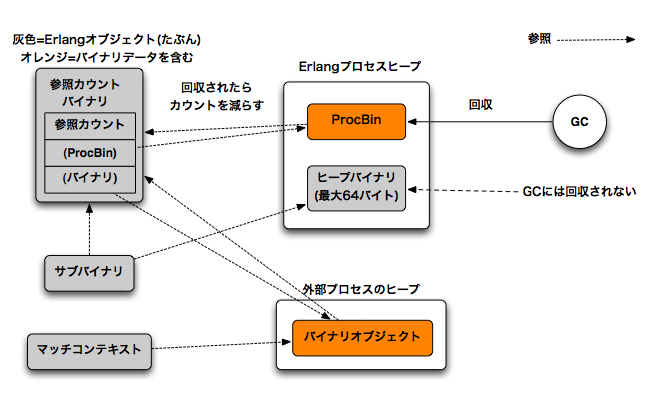

.. highlight:: erlang

.. 4 Constructing and matching binaries

.. index::
  single: バイナリ; 作成

============================
4 バイナリの構築とマッチング
============================

.. In R12B, the most natural way to write binary construction
.. and matching is now significantly faster than in earlier releases.

R12Bからコードが改善され、バイナリを作成したりマッチングのコードを書くための普段もっとも使う書き方に関して、以前のバージョンよりもかなり高速化されました。

.. To construct at binary, you can simply write

バイナリを作成する時には以下のようにシンプルに書くことができます。

.. DO (in R12B) / REALLY DO NOT (in earlier releases)

R12Bでの推奨 / 以前のバージョンで非推奨::

  my_list_to_binary(List) ->
     my_list_to_binary(List, <<>>).

  my_list_to_binary([H|T], Acc) ->
     my_list_to_binary(T, <<Acc/binary,H>>);
  my_list_to_binary([], Acc) ->
     Acc.

.. In releases before R12B, Acc would be copied in every iteration.
   In R12B, Acc will be copied only in the first iteration and extra
   space will be allocated at the end of the copied binary. In the
   next iteration, H will be written in to the extra space. When the
   extra space runs out, the binary will be reallocated with more
   extra space.

R12B以前のリリースでは、Accは繰り返し [1]_ ごとにコピーされていました。R12Bからは最初の繰り返し時だけコピーされ、最終的なコピー済みのバイナリを格納する追加領域が確保されます。次以降の繰り返しからは、Hは追加領域に書かれていきます。追加領域を使い果たしてしまったときは、再割り当てが行われ、領域が増やされます。

.. [1] (訳注)この関数は再帰呼び出しですが、末尾再帰の最適化により繰り返しとなると思われます。

.. The extra space allocated (or reallocated) will be twice
   the size of the existing binary data, or 256, whichever
   is larger.

追加領域の割り当て、あるいは再割り当ては、既存のバイナリデータのサイズの２倍、もしくは256バイトのどちらか大きな方のサイズにて行われます。

.. The most natural way to match binaries is now the fastest:

以下のような、バイナリのマッチのもっとも自然な書き方が、最速の実装になります。

.. DO (in R12B)

推奨(R12B以降)::

   my_binary_to_list(<<H,T/binary>>) ->
       [H|my_binary_to_list(T)];
   my_binary_to_list(<<>>) -> [].

.. 4.1 How binaries are implemented

.. index::
  pair: バイナリ; 実装
  pair: バイナリ; refcバイナリ
  pair: バイナリ; ヒープバイナリ
  pair: バイナリ; ProcBin
  pair: バイナリ; サブバイナリ
  pair: バイナリ; マッチコンテキスト

4.1 バイナリはどのように実装されているのか？
============================================

.. Internally, binaries and bitstrings are implemented
.. in the same way. In this section, we will call them
.. binaries since that is what they are called in the
.. emulator source code.

   
   バイナリの実装(szkttyさん作成)

   この図は原文にあったわけではなく、翻訳時に追加された図なので正確ではない可能性があります。

内部的には、バイナリも、ビット文字列も同じ方法で実装されています。両方ともエミュレータソースコードで呼ばれているように、このセクションでは、両方ともバイナリと呼ぶことにします。

.. There are four types of binary objects internally.
.. Two of them are containers for binary data and
.. two of them are merely references to a part of a binary.

内部では4種類のバイナリオブジェクトがあります。そのうちの２つが、バイナリデータを格納するコンテナで、残りの二つは、バイナリデータの一部を表すリファレンスです。

.. The binary containers are called refc binaries (short
.. for reference-counted binaries) and heap binaries.

バイナリのコンテナはrefcバイナリ、ヒープバイナリと呼ばれています。refcはリファレンスカウントされたバイナリ（reference-counted binaries)の略です。

.. Refc binaries consist of two parts: an object stored
.. on the process heap, called a ProcBin, and the binary
.. object itself stored outside all process heaps.

refcバイナリは二つの部分で構成されています。ひとつはProcBinと呼ばれるプロセスヒープ上に格納されているオブジェクトです。もうひとつはすべてのプロセスヒープ以外の領域に格納されているバイナリオブジェクトになります。

.. The binary object can be referenced by any number
.. of ProcBins from any number of processes; the object
.. contains a reference counter to keep track of the
.. number of references, so that it can be removed
.. when the last reference disappears.

バイナリオブジェクトは他のプロセスのProcBinからも参照することができます。いくつものプロセス上の複数のProcBinから参照することもできます。オブジェクトには、参照数を記憶しておくためのリファレンスカウンタが内蔵されており、最後の参照がなくなった時点で削除されます。

.. All ProcBin objects in a process are part of a linked
.. list, so that the garbage collector can keep track
.. of them and decrement the reference counters in the
.. binary when a ProcBin disappears.

ガーベジコレクタから監視できるように、ProcBinオブジェクト自体がリンクリストとして実装されていて、プロセスの中のすべてのProcBinオブジェクトは連結されています。そして、ProcBinがなくなったら参照カウントが減らされます。

.. Heap binaries are small binaries, up to 64 bytes,
.. that are stored directly on the process heap. They will
.. be copied when the process is garbage collected and
.. when they are sent as a message. They don't require
.. any special handling by the garbage collector.

ヒープバイナリというのは64バイトまでの小さなバイナリのための仕組みです。これはプロセスのヒープに直接格納されます。プロセスがガベージコレクタに回収されたり、ヒープバイナリをメッセージとして送ったりする時には、ヒープバイナリのコピーが作成されます。ヒープバイナリはガベージコレクタから特別扱いはされません。

.. There are two types of reference objects that can
.. reference part of a refc binary or heap binary.
.. They are called sub binaries and match contexts.

リファレンスオブジェクトは２つのタイプがあり、それぞれ、refcバイナリ、ヒープバイナリの一部を表します。これらは、サブバイナリ、マッチコンテキストと呼ばれます。

.. A sub binary is created by split_binary/2 and when a
.. binary is matched out in a binary pattern. A sub binary
.. is a reference into a part of another binary (refc or
.. heap binary, never into a another sub binary). Therefore,
.. matching out a binary is relatively cheap because the
.. actual binary data is never copied.

サブバイナリはsplit_binary/2を作って作成することができます。また、バイナリパターンでマッチさせて作ることもできます。サブバイナリは他のバイナリの一部を示す参照です。ここで言う他のバイナリというのはrefcかヒープバイナリで、他のサブバイナリの一部を参照することはできません。このように、実際にバイナリデータをコピーすることはないので、バイナリをマッチさせて一部を抜きだすという操作は比較的コストの安い操作だということが分かります。

.. A match context is similar to a sub binary, but is optimized for binary matching; for instance, it contains a direct pointer to the binary data. For each field that is matched out of a binary, the position in the match context will be incremented.

マッチコンテキストは、サブバイナリと似ていますが、これはバイナリのマッチに最適化したものになります。実際には、バイナリデータへの直接のポインタを持ちます。バイナリに対してそれぞれのフィールドにマッチするたびに、マッチコンテキストの位置はインクリメントされます。

.. In R11B, a match context was only using during a binary matching operation.

R11Bまではマッチコンテキストはバイナリマッチ操作にしか使用できませんでした。

.. In R12B, the compiler tries to avoid generating code that creates a sub binary, only to shortly afterwards create a new match context and discard the sub binary. Instead of creating a sub binary, the match context is kept.

R12B以降は、コンパイラはできるだけサブバイナリを作成するのを避けて、新しい
マッチコンテキストを作成しようとします。(訳注：同じことを３回言っている？）

.. The compiler can only do this optimization if it can know for sure that the match context will not be shared. If it would be shared, the functional properties (also called referential transparency) of Erlang would break.

この最適化が行えるのは、マッチコンテキストが明らかに共有されることはない、ということが分かっているときに限られます。もし、これが共有されてしまうと、Erlangの関数型の特性(参照透明とも言われる)が壊れてしまうでしょう。

.. 4.2 Constructing binaries

.. index::
  pair: 作成; バイナリ

4.2 バイナリの作成
==================

.. In R12B, appending to a binary or bitstring

R12Bでは以下のようにして、バイナリ、ビット文字列に対して追加すると、ランタイムシステムが特別な最適化を行います。::

 <<Binary/binary, ...>>
 <<Binary/bitstring, ...>>

.. is specially optimized by the run-time system. Because the run-time system handles the optimization (instead of the compiler), there are very few circumstances in which the optimization will not work.

コンパイラではなく、ランタイムシステムが最適化を行っているため、状況によっては最適化がうまく働かないことがあります。

.. To explain how it works, we will go through this code

最適化がどのように行われるかを説明するために、以下のコードを使って見ていきましょう。::

 Bin0 = <<0>>,                    %% 1
 Bin1 = <<Bin0/binary,1,2,3>>,    %% 2
 Bin2 = <<Bin1/binary,4,5,6>>,    %% 3
 Bin3 = <<Bin2/binary,7,8,9>>,    %% 4
 Bin4 = <<Bin1/binary,17>>,       %% 5 !!!
 {Bin4,Bin3}                      %% 6

.. line by line.

一行ずつ見ていきます。

.. The first line (marked with the %% 1 comment), assigns a heap binary to the variable Bin0.

最初の行(%%1とコメントされている)は、ヒープバイナリをBin0という変数に割り当てています。

.. The second line is an append operation. Since Bin0 has not been involved in an append operation, a new refc binary will be created and the contents of Bin0 will be copied into it. The ProcBin part of the refc binary will have its size set to the size of the data stored in the binary, while the binary object will have extra space allocated. The size of the binary object will be either twice the size of Bin0 or 256, whichever is larger. In this case it will be 256.

2行目は、追加の操作になります。Bin0に追加の操作が行われていない間(訳注：notいらなくね？)は、新しいrefcバイナリが作成され、Bin0の内容がそれの中にコピーされます。refcバイナリの一部のProcBinは、バイナリオブジェクトが追加のメモリ領域の割り当てを行ったら、バイナリの中に格納されているデータサイズを、自分のサイズ属性として保持します。バイナリオブジェクトのサイズは、Bin0の2倍か、もしくは256のどちらか大きいほうになります。この場合には256になります。

.. It gets more interesting in the third line. Bin1 has been used in an append operation, and it has 255 bytes of unused storage at the end, so the three new bytes will be stored there.

3行目はもっと興味深いことが発生します。Bin1が追加の操作で使用されますが、Bin1は後ろのほうに255バイトの未使用のストレージがあります。そのため、3つの新しいバイナリ情報がここに格納されます。

.. Same thing in the fourth line. There are 252 bytes left, so there is no problem storing another three bytes.

4行目も同様です。252バイトの秋領域があるため、追加の3バイト分のデータが問題なく格納されます。

.. But in the fifth line something interesting happens. Note that we don't append to the previous result in Bin3, but to Bin1. We expect that Bin4 will be assigned the value <<0,1,2,3,17>>. We also expect that Bin3 will retain its value (<<0,1,2,3,4,5,6,7,8,9>>). Clearly, the run-time system cannot write the byte 17 into the binary, because that would change the value of Bin3 to <<0,1,2,3,4,17,6,7,8,9>>.

しかし、5行目では面白いことが発生します。ここで注意して欲しいのは、前の行のBin3ではなく、前に出てきたBin1に対して追加を行っている点です。私たちはBin4には <<0,1,2,3,17>>という値が割り当てられるのを期待します。また、Bin3に関しても、<< 0,1,2,3,4,5,6,7,8,9>>というもとの値が残ることを期待しています。明らかに、実行時システムは17というバイトをバイナリに書き込むことはできません。というのは、Bin3の値が<<0,1,2,3,4,17,6,7,8,9>>と変化してしまうからです。

.. What will happen?

何が起きているのでしょうか？

.. The run-time system will see that Bin1 is the result from a previous append operation (not from the latest append operation), so it will copy the contents of Bin1 to a new binary and reserve extra storage and so on. (We will not explain here how the run-time system can know that it is not allowed to write into Bin1; it is left as an exercise to the curious reader to figure out how it is done by reading the emulator sources, primarily erl_bits.c.)

ランタイムは、Bin1が以前行われた追加操作の結果であるということを知ります。直前の追加操作という情報からではありません。そこで、ランタイムシステムはBin1の内容を新しいバイナリと、予約済の追加の保存領域などにコピーします。ここでは、ランタイムシステムがどのようにしてBin1に対して書き込むことができるかどうか知ることができるのか、ということについては説明しません。これは好奇心旺盛な読者のためのエクササイズとしておきます。erl_bits.cなどのエミュレータのコードを読むと、どのようにして行っているかを知ることができます。

.. 4.2.1 Circumstances that force copying

.. index::
  pair: バイナリ; コピー
  single: erlangモジュール; port_command/2

4.2.1 強制コピーを行う状況
--------------------------

.. The optimization of the binary append operation requires that there is a single ProcBin and a single reference to the ProcBin for the binary. The reason is that the binary object can be moved (reallocated) during an append operation, and when that happens the pointer in the ProcBin must be updated. If there would be more than on ProcBin pointing to the binary object, it would not be possible to find and update all of them.

バイナリの追加操作の最適化には、ひとつのProcBinと、バイナリに対するひとつのProcBinへの参照が必要となります。理由としては、バイナリオブジェクトは追加操作時に動かしたり、再割り当てを行うことがあり、それが発生してしまうと、ProcBinの中のポインタ値までアップデートしなければならなくなるからです。もしバイナリオブジェクトに対して、２つ以上のProcBinが参照していたとすると、すべてのProcBinを見つけてアップデートすることはできません。

.. (訳注：onはたぶんoneのtypo)

.. Therefore, certain operations on a binary will mark it so that any future append operation will be forced to copy the binary. In most cases, the binary object will be shrunk at the same time to reclaim the extra space allocated for growing.

そのため、バイナリへの特定操作はチェックされて、追加の操作が行われる時に、強制的にバイナリをコピーするかどうか、決定されます。ほとんどのケースでは、バイナリオブジェクトが追加のスペースの割り当てを要求するのと同時に、サイズが縮められます。

.. When appending to a binary

以下のようにバイナリに追加する時::

  Bin = <<Bin0,...>>

.. only the binary returned from the latest append operation will support further cheap append operations. In the code fragment above, appending to Bin will be cheap, while appending to Bin0 will force the creation of a new binary and copying of the contents of Bin0.

バイナリが直前に行われた追加操作から戻ってきたときだけ、コストの安い追加操作がサポートされます。上記のようなコード片の場合、Binに対して追加する操作が行われると、コストの安い方法が使用されます。これに対して、Bin0に対して追加が行われると、強制的に新しいバイナリオブジェクトが作成され、Bin0の内容がコピーされることになります。

.. If a binary is sent as a message to a process or port, the binary will be shrunk and any further append operation will copy the binary data into a new binary. For instance, in the following code fragment

もしバイナリがメッセージとしてプロセスやポートから送信される場合には、バイナリは縮められ、あらゆる追加操作に対して、新しいバイナリオブジェクトへのデータのコピーが強制的に行われるようになります。以下のようなコード片があったとします。::

  Bin1 = <<Bin0,...>>,
  PortOrPid ! Bin1,
  Bin = <<Bin1,...>>  %% Bin1はコピーされる

..   Bin = <<Bin1,...>>  %% Bin1 will be COPIED

.. Bin1 will be copied in the third line.

Bin1は3行目でコピーされるます。

.. The same thing happens if you insert a binary into an ets table or send it to a port using erlang:port_command/2.

同様に、etsテーブルにバイナリを挿入したり、erlang:port_command/2を使用してポートにバイナリを送信しても、同じことが発生します。

.. Matching a binary will also cause it to shrink and the next append operation will copy the binary data:

バイナリのマッチングについても同様に、バイナリの縮小と、次に行われる追加の操作がバイナリデータのコピーになるということが発生します。::

  Bin1 = <<Bin0,...>>,
  <<X,Y,Z,T/binary>> = Bin1,
  Bin = <<Bin1,...>>  %% Bin1はコピーされる

..   Bin = <<Bin1,...>>  %% Bin1 will be COPIED

.. The reason is that a match context contains a direct pointer to the binary data.

これの理由としては、マッチコンテキストはバイナリデータへの直接のポインタを持っているため、そのまま元のデータを加工してしまうと問題が発生してしまうためです。

.. If a process simply keeps binaries (either in "loop data" or in the process dictionary), the garbage collector may eventually shrink the binaries. If only one such binary is kept, it will not be shrunk. If the process later appends to a binary that has been shrunk, the binary object will be reallocated to make place for the data to be appended.

プロセスがループデータ[2]_、もしくはプロセス辞書に格納するなどして、シンプルにバイナリを保持している場合には、最終的にはガーベジコレクタがバイナリを縮めていきます。もし、一つだけしかこのようなバイナリを保持していなかったとすると、そのバイナリは縮められることはありません。もしプロセスが縮められたバイナリに対して後で追加するときには、バイナリオブジェクトは追加されるデータのために再割り当てされることになります。

.. [2] (訳注)おそらく、最適化されてループになった後に、そのループ関数内で使用されるデータのこと

.. 4.3 Matching binaries

.. index::
  single: バイナリ; マッチング

4.3 バイナリのマッチング
========================

.. We will revisit the example shown earlier

前の方で紹介したサンプルを再度紹介します。

.. DO (in R12B)

推奨(R12B)::

    my_binary_to_list(<<H,T/binary>>) ->
        [H|my_binary_to_list(T)];
    my_binary_to_list(<<>>) -> [].

.. too see what is happening under the hood.

それでは、これからフードの下では何が起きているのか、見ていきます。

.. The very first time my_binary_to_list/1 is called, a match context will be created. The match context will point to the first byte of the binary. One byte will be matched out and the match context will be updated to point to the second byte in the binary.

一番最初に my_binary_to_list/1 が呼ばれると、マッチコンテキストが作成されます。このマッチコンテキストバイナリの最初のバイトを指しています。1バイト目にマッチして、マッチコンテキストはバイナリの2バイト目を次に指すようになります。

.. In R11B, at this point a sub binary would be created. In R12B, the compiler sees that there is no point in creating a sub binary, because there will soon be a call to a function (in this case, to my_binary_to_list/1 itself) that will immediately create a new match context and discard the sub binary.

R11Bでは、この時点でサブバイナリが作成されていました。R12Bではコンパイラが判断して、サブバイナリは作成されません。このコードでは、これらはすぐに関数(この場合は今いる関数と同じ my_binary_to_list/1 に対して再帰)呼び出しが発生し、すぐに新しいマッチコンテキストが作成され、サブバイナリが無駄になってしまうということが分かるからです。

.. Therefore, in R12B, my_binary_to_list/1 will call itself with the match context instead of with a sub binary. The instruction that initializes the matching operation will basically do nothing when it sees that it was passed a match context instead of a binary.

そのため、R12Bでは my_binary_to_list/1 はサブバイナリではなく、マッチコンテキストを伴って呼び出されます。マッチ操作は、バイナリの代わりにマッチコンテキストが渡された場合には、基本的に何もしないというように初期化されるでしょう。

.. When the end of the binary is reached and second clause matches, the match context will simply be discarded (removed in the next garbage collection, since there is no longer any reference to it).

バイナリの終端に達して、２つめのクロージャがマッチした場合には、マッチコンテキストはそのまま破棄されます。他のものから参照されなくなるため、次のガーベジコレクションで削除されるでしょう。

.. To summarize, my_binary_to_list/1 in R12B only needs to create one match context and no sub binaries. In R11B, if the binary contains N bytes, N+1 match contexts and N sub binaries will be created.

まとめると、R12Bでは、my_binary_to_list/1では一つのマッチコンテキストが作成され、サブバイナリは作成されません。R11Bでは、バイナリがNバイトあったとすると、N+1個のマッチコンテキストと、N個のサブバイナリが作成されます。

.. In R11B, the fastest way to match binaries is:

R11Bにおいて、バイナリにマッチさせる、もっとも高速な方法は以下の通りです。

.. DO NOT (in R12B)

非推奨(R12B)::

   my_complicated_binary_to_list(Bin) ->
      my_complicated_binary_to_list(Bin, 0).

   my_complicated_binary_to_list(Bin, Skip) ->
      case Bin of
          <<_:Skip/binary,Byte,_/binary>> ->
              [Byte|my_complicated_binary_to_list(Bin, Skip+1)];
          <<_:Skip/binary>> ->
              []
      end.

.. This function cleverly avoids building sub binaries, but it cannot avoid building a match context in each recursion step. Therefore, in both R11B and R12B, my_complicated_binary_to_list/1 builds N+1 match contexts. (In a future release, the compiler might be able to generate code that reuses the match context, but don't hold your breath.)

この関数はずるがしこくサブバイナリの作成から逃れています。しかし、再帰一回ごとにマッチコンテキストが１つ作成されてしまうことからは逃げられていません。そのため、R11BとR12Bの両方で、my_complicated_binary_to_list/1はN+1個のマッチコンテキストが作成されてしまいます。将来のリリースではマッチコンテキストを再利用するようなコードを生成できるようになるはずですが、すぐにそうなる、という過度な期待はしないでください。

.. Returning to my_binary_to_list/1, note that the match context was discarded when the entire binary had been traversed. What happens if the iteration stops before it has reached the end of the binary? Will the optimization still work?

my_binary_to_list/1に返す場合、バイナリがすべて探索し終わる時にマッチコンテキストが破棄される、ということに注意してください。もしバイナリの終端に達する前にイテレーションが止まったらどうなるでしょうか？それでも最適化は働くのでしょうか？::

  After_zero(<<0,T/binary>>) ->
     T;
  after_zero(<<_,T/binary>>) ->
     after_zero(T);
  after_zero(<<>>) ->
     <<>>.

.. Yes, it will. The compiler will remove the building of the sub binary in the second clause

はい。最適化は働きます。コンパイラは２番目の節内でのサブバイナリの作成を削除します。::

  .
  .
  .
  after_zero(<<_,T/binary>>) ->
     after_zero(T);
  .
  .
  .

.. but will generate code that builds a sub binary in the first clause

しかし、最初の節ではサブバイナリを作成するコードを生成します。::

  after_zero(<<0,T/binary>>) ->
     T;

  .
  .
  .

.. Therefore, after_zero/1 will build one match context and one sub binary (assuming it is passed a binary that contains a zero byte).

そのため、ゼロバイトのバイナリが渡されたと仮定すると、after_zero/1は一つのマッチコンテキストと、一つのサブバイナリを作成します。

.. Code like the following will also be optimized:

以下のようなコードも最適化されます。::

  all_but_zeroes_to_list(Buffer, Acc, 0) ->
     {lists:reverse(Acc),Buffer};
  all_but_zeroes_to_list(<<0,T/binary>>, Acc, Remaining) ->
     all_but_zeroes_to_list(T, Acc, Remaining-1);
  all_but_zeroes_to_list(<<Byte,T/binary>>, Acc, Remaining) ->
     all_but_zeroes_to_list(T, [Byte|Acc], Remaining-1).

.. The compiler will remove building of sub binaries in the second and third clauses, and it will add an instruction to the first clause that will convert Buffer from a match context to a sub binary (or do nothing if Buffer already is a binary).

コンパイラは、２番目、３番目の節におけるサブバイナリの作成は削除します。代わりに、最初の節ではBufferをマッチコンテキストからサブバイナリに変換するコードが追加されます。もしBufferがすでにバイナリであれば、何もしません。

.. Before you begin to think that the compiler can optimize any binary patterns, here is a function that the compiler (currently, at least) is not able to optimize:

そろそろ、どんなバイナリのパターンでもコンパイラが最適化してくれると考えているかもしれませんが、以下の関数は少なくとも現在のバージョンでは最適化が行えません。::

  non_opt_eq([H|T1], <<H,T2/binary>>) ->
     non_opt_eq(T1, T2);
  non_opt_eq([_|_], <<_,_/binary>>) ->
     false;
  non_opt_eq([], <<>>) ->
     true.

.. It was briefly mentioned earlier that the compiler can only delay creation of sub binaries if it can be sure that the binary will not be shared. In this case, the compiler cannot be sure.

前の説明で軽く触れましたが、コンパイラができるのは、バイナリが共有されないというのが明確になっている場合にサブバイナリの作成を遅延させることです。この場合はコンパイラはそれが確認できません。

.. We will soon show how to rewrite non_opt_eq/2 so that the delayed sub binary optimization can be applied, and more importantly, we will show how you can find out whether your code can be optimized.

私たちはサブバイナリ作成を遅延化できるようにnon_opt_eq/2を書き換える方法について、すぐに紹介します。そして、これより重要なのは、コードが最適化されているかどうかはどのように判断すればいいのか、というのを紹介することです。

.. 4.3.1 The bin_opt_info option

.. index::
  single: オプション; bin_opt_info
  single: bin_opt_infoオプション
  single: バイナリ; 最適化のための情報

4.3.1 bin_opt_infoオプション
----------------------------

.. Use the bin_opt_info option to have the compiler print a lot of information about binary optimizations. It can be given either to the compiler or erlc

bin_opt_infoオプションを使用することで、バイナリの最適化に関する多くの情報を出力することができます。これはコンパイラとerlc(訳注：erlc以外にコンパイラってあるの？compilerディレクティブ？)にこのオプションを渡すことができます。

.. code-block:: bash
  
  erlc +bin_opt_info Mod.erl

.. or passed via an environment variable

また、環境変数として渡すこともできます。

.. code-block:: bash

  export ERL_COMPILER_OPTIONS=bin_opt_info

.. Note that the bin_opt_info is not meant to be a permanent option added to your Makefiles, because it is not possible to eliminate all messages that it generates. Therefore, passing the option through the environment is in most cases the most practical approach.

このbin_opt_infoはMakefileの中にいつまでも書いておくようなオプションではありません。エラーメッセージなどとは異なり、このオプションが生成するメッセージはすべてなくすということができないからです。そのため、環境変数を通じてオプションを渡すというという方法が、ほとんどのケースで実践的に使われる方法となるでしょう。

.. The warnings will look like this:

警告は以下のように表示されます。

.. code-block:: bash

  ./efficiency_guide.erl:60: Warning: NOT OPTIMIZED: sub binary is used or returned
  ./efficiency_guide.erl:62: Warning: OPTIMIZED: creation of sub binary delayed

.. To make it clearer exactly what code the warnings refer to, in the examples that follow, the warnings are inserted as comments after the clause they refer to:

警告がどのコードを参照しているかを見ると、警告の内容が正確に分かるようになります。以下のサンプルでは警告メッセージをコメントとして節の後に挿入しています::

    after_zero(<<0,T/binary>>) ->
            %% NOT OPTIMIZED: sub binary is used or returned
        T;
    after_zero(<<_,T/binary>>) ->
            %% OPTIMIZED: creation of sub binary delayed
        after_zero(T);
    after_zero(<<>>) ->
        <<>>.

.. The warning for the first clause tells us that it is not possible to delay the creation of a sub binary, because it will be returned. The warning for the second clause tells us that a sub binary will not be created (yet).

最初の節の警告は、即座に返されるためにサブバイナリの生成を遅延させることができないということを伝えています。二番目の節の警告はサブバイナリの生成がこの場ではまだ行われていないということを伝えています。

.. It is time to revisit the earlier example of the code that could not be optimized and find out why:

最初のサンプルコードに戻って参照してみます。警告を出してみると、コードが最適化されていないということと、どういった理由で最適化されていないかということが分かります。::

    non_opt_eq([H|T1], <<H,T2/binary>>) ->
           %% INFO: matching anything else but a plain variable to
           %%    the left of binary pattern will prevent delayed
           %%    sub binary optimization;
           %%    SUGGEST changing argument order
           %% NOT OPTIMIZED: called function non_opt_eq/2 does not
           %%    begin with a suitable binary matching instruction
        non_opt_eq(T1, T2);
    non_opt_eq([_|_], <<_,_/binary>>) ->
        false;
    non_opt_eq([], <<>>) ->
        true.

.. The compiler emitted two warnings. The INFO warning refers to the function non_opt_eq/2 as a callee, indicating that any functions that call non_opt_eq/2 will not be able to make delayed sub binary optimization.

コンパイラは２種類の警告を出しました。INFO警告はnon_opt_eq/2が呼び出される関数として参照し、non_opt_eq/2をコールするどんな関数であっても、サブバイナリ遅延による最適化が行えないということを示しています。

.. There is also a suggestion to change argument order. The second warning (that happens to refer to the same line) refers to the construction of the sub binary itself.

この警告の中では、引数の順番の変更についても提案されています。二番目の警告(最初の警告と同じ行を参照して発生しています)は、サブバイナリの作成がこの中で行われてしまうということを示しています。

.. We will soon show another example that should make the distinction between INFO and NOT OPTIMIZED warnings somewhat clearer, but first we will heed the suggestion to change argument order:

INFOとNOT OPTIMIZED警告が分かりやすく区別できるような他のサンプルコードを見てみましょう。このコードに関しては、引数の順序の変更の提案がされなければならないと思っています。::

   opt_eq(<<H,T1/binary>>, [H|T2]) ->
           %% OPTIMIZED: creation of sub binary delayed
       opt_eq(T1, T2);
   opt_eq(<<_,_/binary>>, [_|_]) ->
       false;
   opt_eq(<<>>, []) ->
       true.

.. The compiler gives a warning for the following code fragment

以下のコード片に関しては、以下のような警告を生成するでしょう。::

  match_body([0|_], <<H,_/binary>>) ->
         %% INFO: matching anything else but a plain variable to
         %%    the left of binary pattern will prevent delayed
         %%    sub binary optimization;
         %%    SUGGEST changing argument order
     done;
     .
     .
     .

.. The warning means that if there is a call to match_body/2 (from another clause in match_body/2 or another function), the delayed sub binary optimization will not be possible. There will be additional warnings for any place where a sub binary is matched out at the end of and passed as the second argument to match_body/2. For instance

この警告が意味することは、match_body/2の他の節、あるいは他の関数からmatch_body/2の呼び出しがあったとすると、サブバイナリ遅延による最適化が行われないということです。他にも、サブバイナリのマッチが最後に行われる、もしくはmatch_body/2の二番目の引数として渡される場合に表示される警告があります。以下にサンプルを表示します。::

    match_head(List, <<_:10,Data/binary>>) ->
            %% NOT OPTIMIZED: called function match_body/2 does not
            %%     begin with a suitable binary matching instruction
        match_body(List, Data).

.. 4.3.2 Unused variables

.. index::
  single: 未使用変数

4.3.2 未使用変数
----------------

.. The compiler itself figures out if a variable is unused. The same code is generated for each of the following functions

コンパイラは未使用の変数の追跡も行います。以下の3つの関数をコンパイルすると、同じコードが生成されます。::

  count1(<<_,T/binary>>, Count) -> count1(T, Count+1);
  count1(<<>>, Count) -> Count.

  count2(<<H,T/binary>>, Count) -> count2(T, Count+1);
  count2(<<>>, Count) -> Count.

  count3(<<_H,T/binary>>, Count) -> count3(T, Count+1);
  count3(<<>>, Count) -> Count.

.. In each iteration, the first 8 bits in the binary will be skipped, not matched out.

それぞれのイテレーションでは、最初の8ビットのバイナリが変数にマッチせずにスキップされます。

Copyright (c) 1991-2009 Ericsson AB
